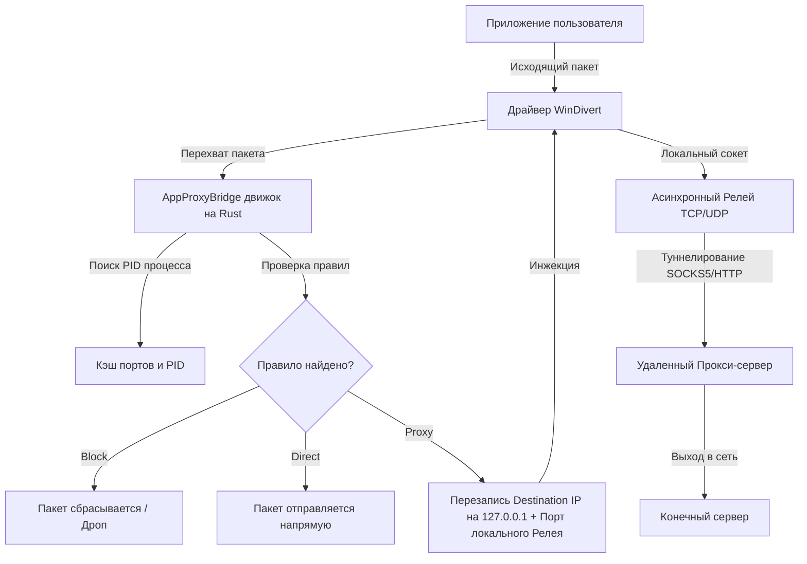

# 🌐 AppProxyBridge

**AppProxyBridge** — это мощная, быстрая и стильная утилита для Windows, предназначенная для прозрачного проксирования, маршрутизации и блокировки сетевого трафика на уровне отдельных процессов операционной системы. 

Программа работает на стыке системного сетевого ядра **Rust (WinDivert)** и современного графического интерфейса **React / Mantine UI (Tauri v2)**, обеспечивая гибкий контроль над сетевой активностью вашего компьютера с премиальным качеством Fluent Design.

---

## ✨ Основной функционал

### 1. 📊 Сетевой монитор реального времени (Группировка по процессам)
* **Автоматическая адаптация высоты:** Таблица сетевого монитора на Дашборде автоматически подстраивается под размеры окна приложения благодаря отзывчивой разметке CSS Flexbox.
* **Попроцессная статистика:** Все активные сетевые подключения группируются по процессам. По каждому процессу в реальном времени отображаются счетчики отправленного/полученного трафика (Bytes Sent/Received) и время последней активности.
* **Цветовая кодировка процессов:** 
  * 🟢 **Зеленый фон и рамка** — процессы, трафик которых перенаправляется через прокси.
  * 🔴 **Красный фон и рамка** — заблокированные процессы.
  * ⚫ **Стандартный темный стиль** — процессы, работающие напрямую.
  * 🟣 **Фиолетовые вспышки** — визуальное отображение мгновенной сетевой активности сокетов.

### 2. ⚡ Гибкие правила маршрутизации (Proxy / Block / Direct)
Вы можете создавать индивидуальные правила для любых программ:
* Поддержка масок/диких карт (например, `*chrome.exe` перехватит трафик всех процессов Chrome, а `telegram.exe` — только Telegram).
* **Три действия на выбор:**
  * **Proxy** — прозрачное перенаправление трафика через выбранный прокси-сервер.
  * **Block** — полная блокировка сетевых пакетов процесса на сетевом уровне.
  * **Direct** — прямое подключение в обход прокси.
* Мгновенное применение правил на лету без необходимости перезапуска движка.

### 3. 🔌 Мульти-прокси пул (SOCKS5 / HTTP)
* Возможность добавления неограниченного количества прокси-серверов.
* Поддержка протоколов **SOCKS5** и **HTTP**.
* Поддержка авторизации по логину и паролю.
* Указание основного (Primary) прокси-сервера, который используется по умолчанию для всех правил проксирования.

### 4. ⚙️ Продвинутые сетевые параметры
Все настройки вынесены в удобный и лаконичный сайдбар:
* **DNS Проксирование:** Перенаправление системных DNS-запросов (UDP порт 53) через активный прокси-сервер для защиты от утечек DNS.
* **Обход локальных адресов (Bypass Local):** Автоматическое направление трафика локальных сетей (Intranet / Loopback) напрямую, минуя прокси.
* **Автозапуск с Windows (Autostart):** Встроенная интеграция в реестр для автоматического запуска приложения вместе с операционной системой.
* **Свертывание в системный трей (Minimize to Tray):** Работа в фоновом режиме. Клик по кнопке закрытия или скрытия сворачивает программу в трей.
* **Запуск в свернутом режиме (Start Minimized):** При включении автозапуска приложение стартует тихо в трей, не отвлекая пользователя окном.

### 5. 📇 Детальная карточка процесса
При клике на любую строку сетевого монитора открывается премиальное модальное окно деталей процесса:
* **Неоновые виджеты трафика:** Яркое визуальное отображение объема отправленных (бирюзовый), полученных (фиолетовый) данных.
* **Индикатор активности сокетов:** Отображение количества активных сокетов и статуса процесса («Активен» / «Сон»).
* **Интерактивное управление:** Возможность в один клик заблокировать процесс, пустить напрямую или привязать к конкретному прокси-серверу прямо из модального окна.

### 🧩 Системный трей Windows
* Полноценная поддержка контекстного меню трея (Показать приложение / Выход).
* **Исправленное поведение кликов:** Окно разворачивается строго по **левому клику** мыши. **Правый клик** стабильно открывает меню трея без мгновенных закрытий и перехвата фокуса окном.
* **100% гарантия видимости:** В бэкенд встроена резервная иконка. Если система не может вернуть иконку по умолчанию, приложение гарантированно подгружает встроенную PNG-иконку из бинарного файла.

---

## 🛠️ Технологический стек

* **Бэкенд (Core):** 
  * **Rust & Tauri v2:** Быстрый, безопасный и невероятно легковесный нативный движок.
  * **WinDivert (Windows Packet Divert):** Драйвер уровня ядра для перехвата, модификации заголовков пакетов и их обратной инжекции в сетевой стек.
  * **Tokio:** Асинхронный рантайм для обработки сетевых релеев.
  * **SQLite (Rusqlite bundled):** Локальная встраиваемая база данных для надежного хранения настроек, прокси-серверов и правил.
* **Фронтенд (UI):**
  * **React & TypeScript & Vite:** Современный отзывчивый UI.
  * **Mantine UI v7:** Премиальная библиотека интерфейсных компонентов в темной теме с эффектами матового стекла (Glassmorphism).
  * **Tabler Icons:** Набор красивых контурных иконок.

---

## 🧱 Архитектура работы движка



---

## 🚀 Быстрый старт

### Требования
1. Операционная система **Windows 10 / 11** (64-бит).
2. Наличие прав **Администратора** (необходимо движку для регистрации драйвера ядра WinDivert в системе при запуске маршрутизации).

### Разработка и запуск
Убедитесь, что на компьютере установлены [Node.js](https://nodejs.org/) и компилятор [Rust](https://www.rust-lang.org/).

1. Установите зависимости:
   ```bash
   npm install
   ```
2. Запустите приложение в режиме разработчика:
   ```bash
   npm run tauri dev
   ```

### Сборка готового инсталлятора
Для сборки оптимизированного автономного `.exe` установщика выполните:
   ```bash
   npm run build
   ```

---

## 🔒 Безопасность и конфиденциальность
* Все конфигурации прокси, логины, пароли и правила маршрутизации хранятся **строго локально** на вашем компьютере в зашифрованной локальной БД SQLite.
* Приложение не совершает никаких внешних запросов к телеметрии или серверам сбора статистики. Весь трафик идет исключительно через настроенные вами прокси-серверы.
